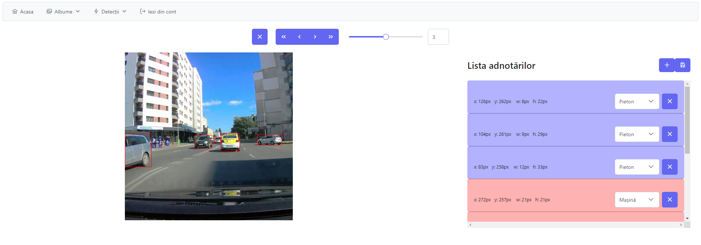

# Semi-automated Image Annotation Platform for Traffic Objects

The development of machine learning systems includes a number of steps, such as selecting the architecture of the model, it's training and validation as well as fine tuning the value of it's hyper-parameters. The fundamental component of a system of this nature is the data because no previously mentioned step can take place without a well annotated data set with enough training examples from which the algorithm can generalize the features and obtain satisfactory results. While the process of collecting data can be automated, annotation is a repetitive and resource inefficient process.

To solve this problem this thesis proposes a way to partially reduce the effort associated with image annotation for the task of traffic objects detection. To do this a "Single Stage" algorithm will be integrated in a web application developed in React and Flask. This app will allow it's users to leverage annotations obtained by deep machine learning models which they can adjust in case of minor errors, delete in case of complete errors and add to, thus streamlining the process of obtaining a data set.

 